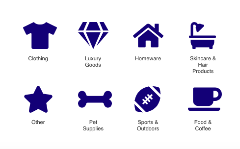

# Shop Sustainably API
### [Link to Web App](https://sustainability.tessgronski.now.sh/)
 
 
Shop Sustainably is a collection of retail stores that sell sustainable products or offer sustainable alternatives. Users looking for new sustainable stores to check out, can either shop all stores or navigate Shop Sustainably by category of interest: 

Users can also add new stores that they want to share with others. 
 
 
### Back End Technologies Used: 
#### -Javascript
#### -PostgreSQL
#### -Express
#### -Knex

### Endpoints: 
______________________________________________________________________________________________________________________________URL

/api/categories

Method:

GET

URL Params

None

Data Params

None

Success Response:

Code: 200
Content: [ ]

URL

/api/categories/:categoriesid

Method:

GET

URL Params

Required:

categoriesid=[integer]

Data Params

None

Success Response:

Code: 200
Sample Content: { categoriesid : 1, categoriesdescription : "Food & Coffee" }
Error Response:

Code: 404 NOT FOUND
{"error":{"message":"Category doesn't exist"}}

______________________________________________________________________________________________________________________________URL

/api/packagings

Method:

GET

URL Params

None

Data Params

None

Success Response:

Code: 200
Content: [ ]

URL

/api/packagings/:packagingsid

Method:

GET

URL Params

Required:
packagingsid=[integer]

Data Params

None

Success Response:

Code: 200
Sample Content: { packagingsid : 1, packagingsdescription : "Yes" }
Error Response:

Code: 404 NOT FOUND
{"error":{"message":"packaging doesn't exist"}}

______________________________________________________________________________________________________________________________URL

/api/ratings

Method:

GET

URL Params

None

Data Params

None

Success Response:

Code: 200
Content: [ ]

URL

/api/ratings/:ratingsid

Method:

GET

URL Params

Required:
ratingsid=[integer]

Data Params

None

Success Response:

Code: 200
Sample Content: { ratingsid : 1, ratingsdescription : "Somewhat Sustainable" }
Error Response:

Code: 404 NOT FOUND
{"error":{"message":"Rating doesn't exist"}}

______________________________________________________________________________________________________________________________URL

/api/stores

Method:

GET

URL Params

None

Data Params

None

Success Response:

Code: 200
Content: [ ]

Method:

POST

URL Params

Required:

None

Data Params

storesid=[integer],
storename=[string],
website=[string],
comments=[string],
packagingsid=[integer],
categoriesid=[integer],
ratingsid=[integer]

Success Response:

Code: 201

Error Response:

Code: 404 NOT FOUND
error: { message: `Missing '${key}' in request body` }

 
URL

/api/stores/:storesid

Method:

GET

URL Params

Required:
storesid=[integer]

Data Params

None

Success Response:

Code: 201
Sample Content: { storeid : 1, storename : "Good Eggs", website: "www.goodeggs.com", lastdatemodified: 2019-12-31, comments: "Good eggs reuses their grocery packaing & sources locally.", packagingsid: 4, categoriesid: 1, ratingsid: 1  }

Error Response:

Code: 404 NOT FOUND
{"error":{"message":"Store doesn't exist"}}

URL

/api/stores/:storesid

Method:

DELETE

URL Params

Required:

None

Data Params

storesid=[integer],
storename=[string],
website=[string],
comments=[string],
packagingsid=[integer],
categoriesid=[integer],
ratingsid=[integer]

Success Response:

Code: 204

